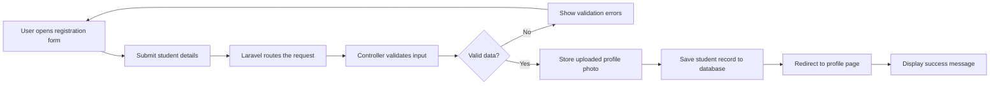
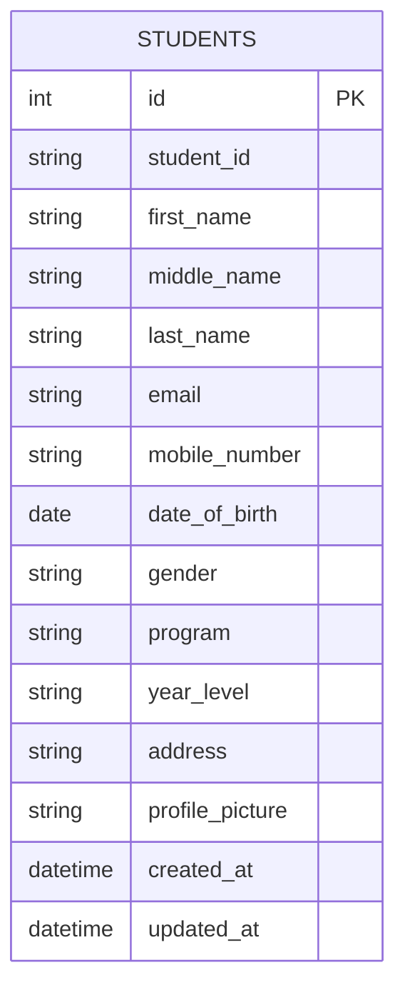
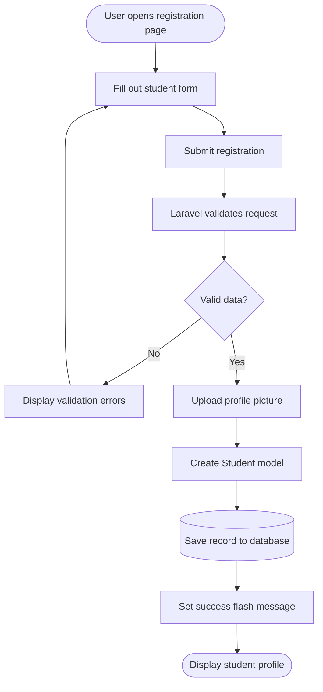

# Student Registration System

A Laravel 12 student registration system for collecting, validating, storing, and displaying student records with profile pictures.

## 1. Introduction

A Student Registration System is a web application that allows an institution to collect and manage student information in one organized location. This project records identity details, contact information, academic placement, and a profile picture. It provides a registration form, a student directory, and an individual student profile page.

Data validation is important because it prevents incomplete, incorrectly formatted, duplicated, or unsafe information from entering the database. Validation improves data quality and gives users clear feedback when a value needs to be corrected. In this project, Laravel validates data on the server before a student record is created.

Registration systems are common in enterprise applications such as university information systems, human resources platforms, healthcare portals, and customer relationship management systems. They provide a controlled entry point for data, support accurate reporting, reduce repetitive manual work, and allow authorized users to retrieve records quickly.

## 2. Objectives

This activity accomplished the following learning objectives:

- Build a CRUD-style registration workflow using Laravel.
- Define routes and connect them to controller actions.
- Create a database table using a Laravel migration.
- Use an Eloquent model for mass assignment and data access.
- Apply server-side validation rules to user-submitted data.
- Validate and securely store an uploaded profile image.
- Display validation errors and session flash messages in Blade views.
- Use route model binding to display a student profile.
- Understand how a web request travels through the Laravel framework.
- Document the application and its database design using Markdown and diagrams.

## 3. Student Registration System Diagram

The registration process follows a simple flow from form submission to final profile display.



## 4. Validation Rules

Validation is performed in `StudentController@store` before any database insert or file storage operation.

| Rule | Fields | Why it matters |
| --- | --- | --- |
| Required | Student ID, first name, last name, email, mobile number, date of birth, gender, program, year level, address, and profile picture | Prevents incomplete student records and ensures essential information is available. Middle name is optional. |
| Unique | `student_id`, `email` | Prevents duplicate student identities and prevents one email address from being assigned to multiple records. |
| Email | `email` | Confirms that the value follows a valid email format before it is used for communication. |
| Numeric | `mobile_number` | Ensures the submitted mobile number contains numeric characters as required by this activity. |
| Image | `profile_picture` with `image` | Rejects non-image uploads and reduces the risk of storing an inappropriate file type. |
| MIME type | `jpg`, `jpeg`, `png` | Limits profile pictures to the image formats supported by the interface. |
| File size | `max:2048` | Limits the image to 2 MB, which reduces storage use and upload time. Laravel file-size limits are expressed in kilobytes. |
| Allowed values | `gender` must be `Male`, `Female`, or `Other` | Keeps categorical data consistent for searching and reporting. |
| String length | Names, student ID, email, program, and year level have maximum lengths | Protects database capacity and prevents unusually large input values. |
| Date | `date_of_birth` | Ensures the date can be interpreted and stored as a date value. |

The form also uses browser-side attributes such as `required`, `type="email"`, and `accept="image/jpeg,image/png"`. These improve the user experience, but server-side validation remains necessary because browser checks can be bypassed.

## 5. Database Design

### Entity Relationship Diagram

The current application contains one main entity. Each row in `students` represents one registered student.



### `students` table structure

| Column | Data type | Key / constraint | Description |
| --- | --- | --- | --- |
| `id` | BIGINT unsigned | Primary key, auto-increment | Internal identifier for each record. |
| `student_id` | VARCHAR(255) | Unique, not nullable | Institution-provided student identifier. |
| `first_name` | VARCHAR(255) | Not nullable | Student's first name. |
| `middle_name` | VARCHAR(255) | Nullable | Student's middle name, when provided. |
| `last_name` | VARCHAR(255) | Not nullable | Student's last name. |
| `email` | VARCHAR(255) | Unique, not nullable | Student's email address. |
| `mobile_number` | VARCHAR(255) | Not nullable | Contact number stored as text to preserve formatting and leading zeroes. |
| `date_of_birth` | DATE | Not nullable | Student's birth date. |
| `gender` | VARCHAR(255) | Not nullable | Selected gender value. |
| `program` | VARCHAR(255) | Not nullable | Academic program. |
| `year_level` | VARCHAR(255) | Not nullable | Current year level. |
| `address` | TEXT | Not nullable | Complete residential address. |
| `profile_picture` | VARCHAR(255) | Not nullable | Path to the image stored on Laravel's public disk. |
| `created_at`, `updated_at` | TIMESTAMP | Laravel timestamps | Record creation and modification times. |

The primary key is `id`. The unique constraints on `student_id` and `email` provide database-level protection against duplicates in addition to controller validation. The model's `$fillable` list explicitly permits only the expected registration fields for mass assignment.

## 6. Registration Flowchart



## 7. Screenshots

<div align="center">
  <h3>Registration Form</h3>
  
</div>

<div align="center">
  <h3>Validation Errors</h3>
  
</div>

<div align="center">
  <h3>Successful Registration</h3>
  
</div>

<div align="center">
  <h3>Flash Message</h3>
  
</div>

<div align="center">
  <h3>Uploaded Profile Picture</h3>
  
</div>

<div align="center">
  <h3>Student Profile Page</h3>
  
</div>

<div align="center">
  <h3>VS Code Project Structure</h3>
  
</div>

<div align="center">
  <h3>GitHub Repository</h3>
  
</div>

## 8. Problems Encountered

1. **Validation errors were not appearing clearly.** Without field-level error output, users could not tell which input needed correction.
2. **The image upload path could be incorrect.** Laravel stores the image path in the database, while the browser needs a publicly accessible URL to display the file.
3. **The database migration could fail or the table could be missing.** The application cannot create student records until the `students` migration has been run against the configured database.
4. **The storage link could be missing.** Files stored on Laravel's `public` disk need the `public/storage` symbolic link before browser URLs can resolve correctly.

## 9. Solutions

1. The Blade views use Laravel's `@error` directive beside each field. The controller returns to the form automatically after validation failure, and Laravel preserves old input so the user does not need to retype everything.
2. The controller stores the uploaded image with `$request->file('profile_picture')->store('students', 'public')`. The profile and directory views display it with `asset('storage/' . $student->profile_picture)`, matching Laravel's public-disk convention.
3. The migration in `database/migrations/2026_08_28_091703_create_students_table.php` defines the table. Running `php artisan migrate` creates the table, and checking the configured `.env` database connection confirms Laravel is using the intended database.
4. Running `php artisan storage:link` creates the public link from `storage/app/public` to `public/storage`. After that, uploaded profile images can be loaded by the browser.

## 10. Reflection

Validation is one of the most important parts of a student registration system because the information collected becomes a source of truth for other activities. A record with a missing name, invalid email, duplicate student ID, or unreadable image can create problems for admissions, reporting, communication, and future updates. Validation provides a controlled boundary between user input and application data. In this project, Laravel's validation rules made that boundary explicit and returned useful messages when the submitted data did not meet the requirements.

I learned that handling user input involves more than reading values from a form. The application must decide which fields are required, which formats are acceptable, which values are unique, and how much data should be stored. I also learned that valid data sometimes needs normalization. The controller formats names consistently before creating the model, which makes the directory easier to read. The model then provides a structured way to access the saved student and its attributes.

Server-side validation is more dependable than client-side validation alone. HTML attributes such as `required` and `type="email"` are helpful because they give immediate feedback in the browser, but they can be disabled or bypassed by sending a request directly to the server. Laravel validates every request at the application boundary, regardless of the browser or tool that sent it. Database unique constraints provide another layer of protection against duplicate student IDs and email addresses.

File security is also important. An uploaded file should not be trusted just because its filename ends in `.jpg` or `.png`. The application checks that the file is an image, restricts the accepted MIME extensions, and limits the size to 2 MB. Storing the file through Laravel's storage system and saving only its generated path in the database keeps the record manageable and gives the application a consistent way to serve the image. In a production system, additional controls such as authorization, malware scanning, private storage, and carefully configured permissions would also be appropriate.

In real enterprise software, registration systems connect people to larger workflows. A university may use a student record to support enrollment, schedules, billing, advising, identification cards, and reports. The same design pattern appears in employee onboarding, patient registration, and customer account creation. This activity showed me how routes, controllers, validation, models, migrations, views, and storage work together to turn a form into a dependable business process. The main lesson is that a registration page is not only a user interface; it is the first controlled step in maintaining trustworthy organizational data.

The project also demonstrated why a reliable workflow needs clear responsibilities. The route identifies the action, the controller coordinates it, the validator protects the boundary, the model represents the record, and the database enforces persistence. Separating these responsibilities makes future changes easier, such as adding search, editing, authentication, or additional student fields. It also makes errors easier to investigate because each part of the process has a clear purpose. In a real deployment, student information would additionally require access control, privacy policies, backups, audit logs, and careful handling of personally identifiable information.

## 11. References

Laravel. (n.d.). *Laravel documentation*. Retrieved September 8, 2026, from https://laravel.com/docs

MDN Web Docs. (n.d.). *HTML forms guide*. Retrieved September 8, 2026, from https://developer.mozilla.org/en-US/docs/Learn_web_development/Extensions/Forms

MySQL. (n.d.). *MySQL 8.4 reference manual*. Retrieved September 8, 2026, from https://dev.mysql.com/doc/refman/8.4/en/

PHP Documentation Group. (n.d.). *PHP manual*. Retrieved September 8, 2026, from https://www.php.net/docs.php

Tailwind Labs. (n.d.). *Tailwind CSS documentation*. Retrieved September 8, 2026, from https://tailwindcss.com/docs

## 12. Running the Project

### Requirements

- PHP 8.2 or newer
- Composer
- Node.js and npm
- A configured database such as SQLite or MySQL

### Setup

```bash
composer install
cp .env.example .env
php artisan key:generate
php artisan migrate
npm install
npm run build
php artisan storage:link
php artisan serve
```

Open `http://127.0.0.1:8000` in a browser. The root route opens the registration form. The student directory is available at `/students`.

### Useful commands

```bash
php artisan migrate:fresh
php artisan test
php artisan route:list
php artisan storage:link
```
